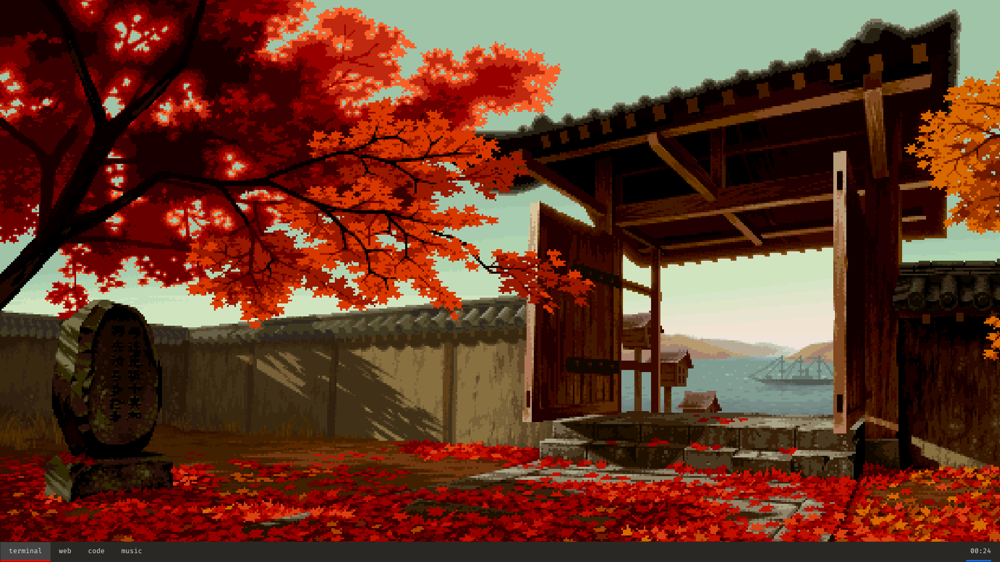
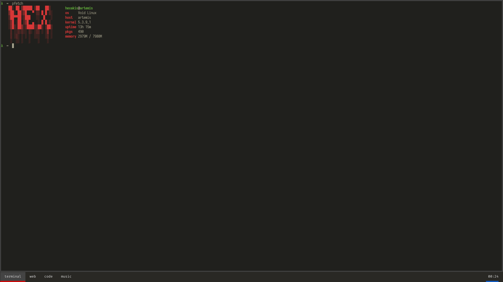

<pre align="center">
    ██░ ██ ▓█████ ▒██   ██▒
    ▓██░ ██▒▓█   ▀ ▒▒ █ █ ▒░
    ▒██▀▀██░▒███   ░░  █   ░
    ░▓█ ░██ ▒▓█  ▄  ░ █ █ ▒ 
    ░▓█▒░██▓░▒████▒▒██▒ ▒██▒
     ▒ ░░▒░▒░░ ▒░ ░▒▒ ░ ░▓ ░
     ▒ ░▒░ ░ ░ ░  ░░░   ░▒ ░
     ░  ░░ ░   ░    ░    ░  
     ░  ░  ░   ░  ░ ░    ░
</pre>

## Information
> This is my **Void Linux** setup. You can use these config files as you please, but I am not by any means responsible
> for any damage done to your setup and will not help out fixing it.

os: **void linux**  
terminal: **alacritty**  
text editor: **neovim**  
window switcher: **rofi**  
window manager: **bspwm**

