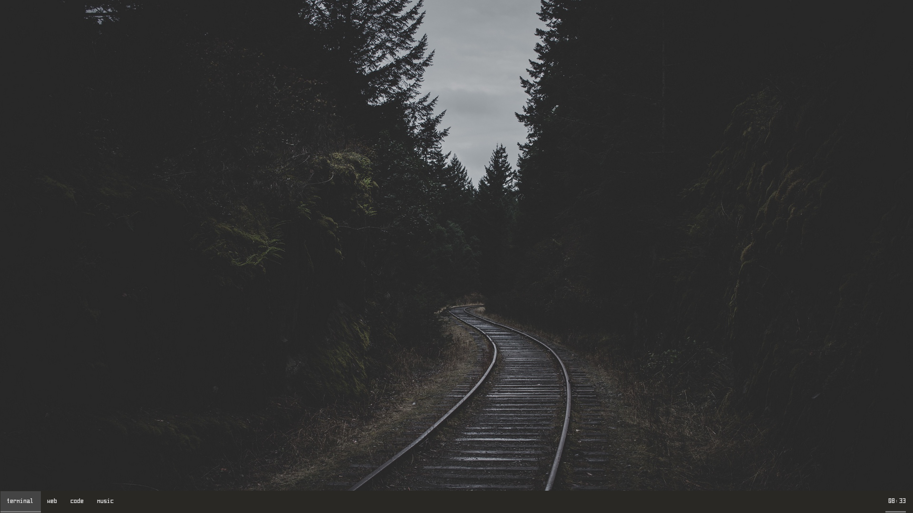
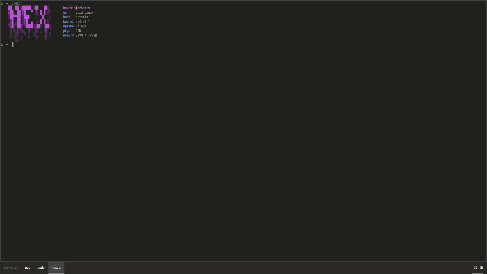

<pre align="center">
    ██░ ██ ▓█████ ▒██   ██▒
    ▓██░ ██▒▓█   ▀ ▒▒ █ █ ▒░
    ▒██▀▀██░▒███   ░░  █   ░
    ░▓█ ░██ ▒▓█  ▄  ░ █ █ ▒ 
    ░▓█▒░██▓░▒████▒▒██▒ ▒██▒
     ▒ ░░▒░▒░░ ▒░ ░▒▒ ░ ░▓ ░
     ▒ ░▒░ ░ ░ ░  ░░░   ░▒ ░
     ░  ░░ ░   ░    ░    ░  
     ░  ░  ░   ░  ░ ░    ░
</pre>

## Information
os: ***void linux***  
terminal: ***alacritty***  
text editor: ***neovim***  
window switcher: ***rofi***  
window manager: ***bspwm***

> Desktop

> Terminal

